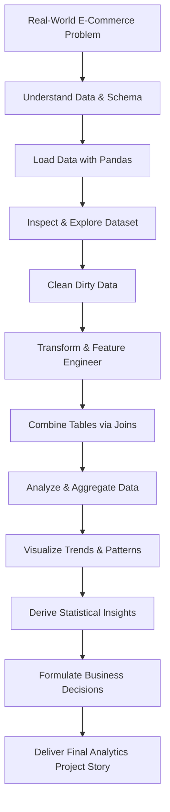
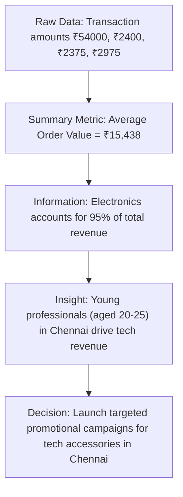

# Data Analytics — Beginner to Project Roadmap

## Overall Journey



---

## Dataset Reference for this Guide

All concepts and code examples in this roadmap utilize our unified **E-Commerce Dataset** available directly in the folder:

- **Primary Dataset:** [`ecommerce.csv`](file:///Users/harinikesh/Downloads/data_analytics_notebook/day1_/ecommerce.csv) (100 multi-category transaction records)
- **Relational Tables (for Joins & Merging):** 
  - [`customers.csv`](file:///Users/harinikesh/Downloads/data_analytics_notebook/day1_/customers.csv) — Customer Master (`customer_id`, `name`, `age`, `city`)
  - [`orders.csv`](file:///Users/harinikesh/Downloads/data_analytics_notebook/day1_/orders.csv) — Order Transactions (`order_id`, `customer_id`, `product_category`, `product_name`, `price`, `quantity`, `discount_pct`, `purchase_amount`, `payment_method`, `device`, `session_duration_mins`, `order_date`, `returned`)

---

## Build the Data Analytics Mindset

### What is Data?

#### Goal
Understand what "data" actually means in a real-world business context.

Consider the first few rows of our E-Commerce dataset:

| order_id | customer_id | name | age | city | product_category | product_name | price | quantity | discount_pct | purchase_amount |
| :--- | :--- | :--- | :--- | :--- | :--- | :--- | :--- | :--- | :--- | :--- |
| ORD001 | C001 | Arun | 21 | Chennai | Electronics | Laptop | 60000 | 1 | 0.10 | 54000.0 |
| ORD002 | C002 | Priya | 25 | Coimbatore | Electronics | Wireless Mouse | 1200 | 2 | 0.00 | 2400.0 |
| ORD003 | C003 | Ravi | 31 | Chennai | Electronics | Mechanical Keyboard | 2500 | 1 | 0.05 | 2375.0 |
| ORD004 | C004 | Meena | 22 | Madurai | Fashion | Running Shoes | 3500 | 1 | 0.15 | 2975.0 |

> "What can we learn from this dataset?"

- **Highest spending customer:** Arun (₹54,000 for a Laptop).
- **Average purchase value:** $(54000 + 2400 + 2375 + 2975) / 4 = ₹15,437.50$.
- **City-level demand:** Chennai has the highest order volume (2 out of 4 orders).
- **Category breakdown:** Electronics drives the vast majority of total sales.

#### The Core Concept:
- **Data** is raw material (rows, numbers, strings).
- **Analytics** is the process of converting raw material into actionable business decisions.

#### Example Walkthrough (Data to Decision Pipeline)



#### Student Activity
Look at the 4 rows above and ask:
> *"What 5 business questions can this dataset answer without writing any code?"*

---

### What is Data Analytics?

> **Data Analytics** = Examining datasets to discover patterns, relationships, and actionable insights that guide business decisions.

#### Real-World Business Problem
An E-Commerce company executive says:
> *"Our quarterly revenue is falling. Find out why and tell us what to do."*

**How an analyst investigates the problem step-by-step:**
```text
Revenue is falling
        ↓
Which product categories are declining?
        ↓
Which cities or regions are affected?
        ↓
Which customer age groups are buying less?
        ↓
Are customers spending less time on the mobile app?
        ↓
Have product return rates increased?
        ↓
Why did it happen? (Diagnostic)
        ↓
What action should management take? (Prescriptive)
```

> **Key Takeaway:** Analytics always begins with a clear business question, not with code.

---

### Data Science vs Data Analytics

In our E-Commerce ecosystem:

```text
Data Science Ecosystem
    │
    ├── Data Engineering: How do we capture and store millions of daily transactions?
    ├── Data Analytics: Which products generated the highest revenue last month?
    ├── Machine Learning: Which customer is likely to churn or return a product next month?
    └── AI: How do we power an automated conversational shopping assistant?
```

> **Key Takeaway:** Data Analytics focuses on understanding past and present data to guide immediate business actions.

---

## Understand the Data

### Types of Data

Using our E-Commerce dataset:

| customer_id | name | age | city | product_category | price | quantity | purchase_amount | order_date | returned |
| :--- | :--- | :--- | :--- | :--- | :--- | :--- | :--- | :--- | :--- |
| C001 | Arun | 21 | Chennai | Electronics | 60000 | 1 | 54000.0 | 2026-01-05 10:30 | No |
| C002 | Priya | 25 | Coimbatore | Electronics | 1200 | 2 | 2400.0 | 2026-01-06 14:15 | No |
| C003 | Ravi | 31 | Chennai | Electronics | 2500 | 1 | 2375.0 | 2026-01-07 16:45 | No |
| C004 | Meena | 22 | Madurai | Fashion | 3500 | 1 | 2975.0 | 2026-01-08 11:20 | Yes |

We classify every column into 4 fundamental data types:

- **Numerical (Quantitative):** `age`, `price`, `quantity`, `discount_pct`, `purchase_amount`, `session_duration_mins` (can calculate sums, averages, medians).
- **Categorical (Qualitative):** `city`, `product_category`, `product_name`, `payment_method`, `device`, `returned` (can group, count, find frequencies).
- **DateTime (Temporal):** `order_date` (can extract month, day of week, analyze trends).
- **Identifier (Unique Keys):** `order_id`, `customer_id` (used to track unique entities and join tables).

---

### Structured vs Semi-Structured vs Unstructured Data

The same E-Commerce customer record can exist in three formats:

#### 1. Structured Data (Tabular Rows & Columns)
| customer_id | age | city | product_category | purchase_amount |
| :--- | :--- | :--- | :--- | :--- |
| C001 | 21 | Chennai | Electronics | 54000.0 |

#### 2. Semi-Structured Data (JSON / API Response)
```json
{
  "order_id": "ORD001",
  "customer_id": "C001",
  "age": 21,
  "city": "Chennai",
  "order": {
    "product_category": "Electronics",
    "product_name": "Laptop",
    "purchase_amount": 54000.0
  }
}
```

#### 3. Unstructured Data (Customer Review Text)
> "I ordered the laptop from Chennai. The packaging was good, but delivery was delayed by 2 days."

> **Note:** Foundational data analytics primarily works with **structured tabular data**.

---

## Start Python for Analytics

### Python Basics Required for Analytics

We only need the subset of Python used to manipulate data.

#### 1. Variables & Calculations (Computing Revenue)
```python
price = 60000
quantity = 1
discount = 0.10

purchase_amount = price * quantity * (1 - discount)
print("Net Purchase Amount: ₹", purchase_amount)
# Output: Net Purchase Amount: ₹ 54000.0
```

#### 2. Lists (Storing Prices)
```python
purchase_amounts = [54000.0, 2400.0, 2375.0, 2975.0]
```

#### 3. Conditional Logic (Flagging VIP Customers)
```python
purchase_amount = 54000.0

if purchase_amount > 5000:
    print("High-Value VIP Customer")
else:
    print("Standard Customer")
```

#### 4. Loops (Iterating Over Transactions)
```python
purchase_amounts = [54000.0, 2400.0, 2375.0, 2975.0]

for amount in purchase_amounts:
    print(f"Transaction: ₹{amount}")
```

---

### Introduce Pandas

Pandas represents tabular data as a **DataFrame**:

```python
import pandas as pd

# Creating our E-Commerce dataset
data = {
    "order_id": ["ORD001", "ORD002", "ORD003", "ORD004"],
    "customer_id": ["C001", "C002", "C003", "C004"],
    "name": ["Arun", "Priya", "Ravi", "Meena"],
    "city": ["Chennai", "Coimbatore", "Chennai", "Madurai"],
    "product_category": ["Electronics", "Electronics", "Electronics", "Fashion"],
    "purchase_amount": [54000.0, 2400.0, 2375.0, 2975.0]
}

df = pd.DataFrame(data)
print(df)
```

**Output:**
```text
  order_id customer_id   name        city product_category  purchase_amount
0   ORD001        C001   Arun     Chennai      Electronics          54000.0
1   ORD002        C002  Priya  Coimbatore      Electronics           2400.0
2   ORD003        C003   Ravi     Chennai      Electronics           2375.0
3   ORD004        C004  Meena     Madurai          Fashion           2975.0
```

---

### Load Real Data

In real projects, data is stored in CSV files:

```python
df = pd.read_csv("ecommerce.csv")
df.head()
```

**First Question an Analyst Asks:**
> *"I just loaded this dataset. What is its size, what columns exist, and are there missing values?"*

---

## Learn to Inspect Data

### Understanding a Dataset

Use these essential inspection commands on our `ecommerce.csv` dataset:

| Method / Property | Code Syntax | What It Answers |
| :--- | :--- | :--- |
| **First Rows** | `df.head(5)` | What do the actual rows and values look like? |
| **Last Rows** | `df.tail(5)` | Are there corrupted summary rows at the end? |
| **Dimensions** | `df.shape` | How many rows (orders) and columns (attributes) exist? |
| **Column Names** | `df.columns` | What attributes are available for analysis? |
| **Data Types & Nulls**| `df.info()` | Are numbers stored as integers/floats? Are there missing values? |
| **Summary Statistics**| `df.describe()` | What are the mean, minimum, maximum, and median purchase amounts? |

---

### Ask Questions About Data

Given our E-Commerce dataset:

| customer_id | age | city | product_category | purchase_amount |
| :--- | :--- | :--- | :--- | :--- |
| C001 | 21 | Chennai | Electronics | 54000.0 |
| C002 | 25 | Coimbatore | Electronics | 2400.0 |
| C003 | 31 | Chennai | Electronics | 2375.0 |
| C004 | 22 | Madurai | Fashion | 2975.0 |
| C005 | 45 | Bengaluru | Grocery | 1950.0 |

**Formulate Analytical Questions:**
1. What is the average purchase amount across all customers?
2. Which customer generated the highest individual order value?
3. What is the total spending in Chennai vs. Coimbatore?
4. Do older customers spend more than younger customers?

> **Golden Rule:** Formulate business questions before writing analytical code.

---

## Data Cleaning

### Missing Data

Consider an uncleaned version of our E-Commerce dataset:

| customer_id | age | city | purchase_amount |
| :--- | :--- | :--- | :--- |
| C001 | 21 | Chennai | 54000.0 |
| C002 | `NaN` | Coimbatore | 2400.0 |
| C003 | 31 | `NaN` | 2375.0 |
| C004 | 22 | Madurai | `NaN` |

#### Detection & Treatment:
```python
# 1. Count missing values in each column
df.isnull().sum()

# 2. Option A: Drop rows with missing values
df.dropna()

# 3. Option B: Impute missing numerical values with Median
df["age"] = df["age"].fillna(df["age"].median())

# 4. Option C: Impute missing categorical values with Mode
df["city"] = df["city"].fillna(df["city"].mode()[0])
```

> **Important:** Choose between dropping or imputing based on business context.

---

### Duplicate Data

Consider duplicate order records:

| order_id | customer_id | city | purchase_amount |
| :--- | :--- | :--- | :--- |
| ORD001 | C001 | Chennai | 54000.0 |
| ORD002 | C002 | Coimbatore | 2400.0 |
| ORD001 | C001 | Chennai | 54000.0 |

```python
# Identify duplicate rows
df.duplicated()

# Remove duplicate rows
df.drop_duplicates()
```

---

### Incorrect & Inconsistent Data

#### 1. Impossible Numerical Outliers
| customer_id | age | purchase_amount |
| :--- | :--- | :--- |
| C001 | 21 | 54000.0 |
| C002 | **250** *(Invalid Age)* | 2400.0 |
| C003 | 31 | 2375.0 |

- Python treats `250` as a valid integer, but domain logic tells us it is an error.
- **Action:** Filter or replace invalid values:
  ```python
  df.loc[(df["age"] < 18) | (df["age"] > 100), "age"] = df["age"].median()
  ```

#### 2. Text Inconsistency (Casing & Whitespace)
```text
Chennai
chennai
CHENNAI
Chennai 
```
- **Action:** Standardize text strings:
  ```python
  df["city"] = df["city"].astype(str).str.strip().str.title()
  ```

---

## Data Transformation

### Creating New Columns (Feature Engineering)

Given our E-Commerce price and quantity:

| price | quantity | discount_pct |
| :--- | :--- | :--- |
| 60000 | 1 | 0.10 |
| 1200 | 2 | 0.00 |
| 2500 | 1 | 0.05 |

```python
# Calculate gross revenue
df["gross_revenue"] = df["price"] * df["quantity"]

# Calculate net purchase amount after discount
df["purchase_amount"] = df["gross_revenue"] * (1 - df["discount_pct"])
```

**Result:**
| price | quantity | discount_pct | gross_revenue | purchase_amount |
| :--- | :--- | :--- | :--- | :--- |
| 60000 | 1 | 0.10 | 60000 | 54000.0 |
| 1200 | 2 | 0.00 | 2400 | 2400.0 |
| 2500 | 1 | 0.05 | 2500 | 2375.0 |

---

### Filtering Data

#### Single Condition
```python
# Orders where purchase amount exceeds ₹5,000
df[df["purchase_amount"] > 5000]

# Orders from Chennai
df[df["city"] == "Chennai"]
```

#### Compound Conditions (AND / OR)
```python
# High-value orders (> ₹5,000) placed in Chennai
df[
    (df["city"] == "Chennai") & 
    (df["purchase_amount"] > 5000)
]
```

---

### Sorting

```python
# Rank transactions from highest to lowest spending
df.sort_values(by="purchase_amount", ascending=False)
```

---

### Grouping & Aggregations

Given transactions by city:

| city | purchase_amount |
| :--- | :--- |
| Chennai | 54000.0 |
| Coimbatore | 2400.0 |
| Chennai | 2375.0 |
| Madurai | 2975.0 |

```python
# Calculate Total Revenue per City
df.groupby("city")["purchase_amount"].sum()
```

**Result:**
```text
city
Chennai       56375.0
Coimbatore     2400.0
Madurai        2975.0
Name: purchase_amount, dtype: float64
```

Common aggregation functions:
- `.sum()`: Total revenue
- `.mean()`: Average Order Value (AOV)
- `.count()`: Total number of orders
- `.min()` / `.max()`: Lowest and highest transactions

---

## Combining Data

### Why Do We Need Multiple Tables?

In real e-commerce systems, customer profiles and order transactions are stored in separate tables to avoid redundant data.

#### Customers Table ([`customers.csv`](file:///Users/harinikesh/Downloads/data_analytics_notebook/day1_/customers.csv))
| customer_id | name | age | city |
| :--- | :--- | :--- | :--- |
| C001 | Arun | 21 | Chennai |
| C002 | Priya | 25 | Coimbatore |

#### Orders Table ([`orders.csv`](file:///Users/harinikesh/Downloads/data_analytics_notebook/day1_/orders.csv))
| order_id | customer_id | product_category | purchase_amount |
| :--- | :--- | :--- | :--- |
| ORD001 | C001 | Electronics | 54000.0 |
| ORD002 | C002 | Electronics | 2400.0 |

**Common Key (Foreign Key):** `customer_id`

---

### Merging Datasets

```python
customers = pd.read_csv("customers.csv")
orders = pd.read_csv("orders.csv")

result = orders.merge(customers, on="customer_id", how="inner")
```

**Merged Result:**
| order_id | customer_id | product_category | purchase_amount | name | age | city |
| :--- | :--- | :--- | :--- | :--- | :--- | :--- |
| ORD001 | C001 | Electronics | 54000.0 | Arun | 21 | Chennai |
| ORD002 | C002 | Electronics | 2400.0 | Priya | 25 | Coimbatore |

#### Join Types Concept:
- **INNER JOIN:** Keep orders that match existing customers.
- **LEFT JOIN:** Keep all orders, even if customer details are missing.
- **RIGHT JOIN:** Keep all registered customers, even if they have placed 0 orders.
- **OUTER JOIN:** Keep all records from both tables.

---

## Reshaping and Pivoting

### Pivot Tables

Given e-commerce transactions across cities and categories:

| city | product_category | purchase_amount |
| :--- | :--- | :--- |
| Chennai | Electronics | 56375.0 |
| Chennai | Fashion | 4500.0 |
| Coimbatore | Electronics | 2400.0 |
| Coimbatore | Fashion | 3200.0 |

```python
# Create a City × Category Revenue Matrix
pd.pivot_table(
    df,
    values="purchase_amount",
    index="city",
    columns="product_category",
    aggfunc="sum",
    fill_value=0
)
```

**Result Matrix:**
| city | Electronics | Fashion |
| :--- | :--- | :--- |
| Chennai | 56375.0 | 4500.0 |
| Coimbatore | 2400.0 | 3200.0 |

---

## Exploratory Data Analysis (EDA)

> **EDA** is the process of investigating a dataset to understand distributions, relationships, anomalies, and underlying patterns.

### 1. Univariate Analysis (One Variable)
- **Examining:** `Customer Age`
- **Questions:** What is the average age? What is the age range of shoppers?
```python
df["age"].describe()
df["age"].plot.hist()
```

### 2. Bivariate Analysis (Two Variables)
- **Examining:** `Age` vs. `Purchase Amount`
- **Question:** *"Do older customers spend more money?"*
```python
df.plot.scatter(x="age", y="purchase_amount")
```

### 3. Multivariate Analysis (Three or More Variables)
- **Examining:** `Age Group` + `City` + `Product Category` + `Purchase Amount`
- **Question:** *"Which age group in Chennai spends the most on Electronics?"*

---

## Statistics for Analytics

### Descriptive Statistics: Mean vs. Median

Consider transaction amounts in our dataset:
- ₹1,200
- ₹2,375
- ₹2,400
- ₹2,975
- **₹54,000** *(Laptop purchase — High Outlier)*

| Metric | Calculation | Value |
| :--- | :--- | :--- |
| **Mean (Average)** | $(1200 + 2375 + 2400 + 2975 + 54000) / 5$ | **₹12,590** |
| **Median (Middle Value)** | Middle sorted element | **₹2,400** |

> **Analyst Insight:** The single ₹54,000 purchase pulls the mean to ₹12,590. The **median (₹2,400)** is much more representative of what a typical customer spends.

---

### Distributions & Skewness

- **Normal Distribution:** Symmetrical bell curve (Mean $\approx$ Median).
- **Right-Skewed Distribution:** Long right tail of high spenders (Mean $>$ Median). Common in E-Commerce.
- **Spread:** Measured by Standard Deviation and Variance.

---

## Visualization

### Choosing the Right Chart

| Business Question | Best Chart Type | E-Commerce Example |
| :--- | :--- | :--- |
| Which category generates the most revenue? | **Bar Chart** | Total sales by category (`Electronics`, `Fashion`, etc.) |
| How did monthly sales grow over the year? | **Line Chart** | Monthly revenue from Jan to Aug |
| How is customer spending distributed? | **Histogram** | Frequency of orders across price brackets |
| Does app browsing time increase spending? | **Scatter Plot**| `session_duration_mins` vs. `purchase_amount` |
| What are the ticket size outliers by category? | **Box Plot** | Price variation in Electronics vs. Grocery |

---

### Visual Code Examples

#### 1. Bar Chart (Category Revenue)
```python
df.groupby("product_category")["purchase_amount"].sum().plot.bar()
```

#### 2. Line Chart (Monthly Revenue Trend)
```python
df["order_date"] = pd.to_datetime(df["order_date"])
df["month"] = df["order_date"].dt.month
df.groupby("month")["purchase_amount"].sum().plot.line()
```

#### 3. Histogram (Purchase Distribution)
```python
df["purchase_amount"].plot.hist(bins=20)
```

#### 4. Scatter Plot (Engagement vs. Spend)
```python
df.plot.scatter(x="session_duration_mins", y="purchase_amount")
```

> **Critical Principle:** $\text{Correlation} \neq \text{Causation}$.

---

## Types of Analytics


Using our E-Commerce dataset:

1. **Descriptive Analytics:** *"Total revenue across all cities is ₹52.25 Lakhs."*
2. **Diagnostic Analytics:** *"Electronics drove 76% of sales due to high AOV (₹20,242), while Fashion had high returns (17.4%)."*
3. **Predictive Analytics:** *"Based on month-over-month growth, Q4 sales will reach ₹66.88 Lakhs."*
4. **Prescriptive Analytics:** *"Launch an exclusive VIP loyalty tier for high spenders and improve Fashion sizing guides."*

---

## Popular Data Analytics Methods

### Customer Segmentation

Divide customers into 3 tiers based on cumulative spending:
- **Low Value Tier:** Spending $\le ₹5,000$
- **Medium Value Tier:** Spending $₹5,001 \text{ to } ₹20,000$
- **High Value Tier:** Spending $> ₹20,000$

> **Business Finding:** High-Value customers represent **92.8%** of total revenue.

---

### Correlation Analysis

```python
# Calculate correlation between session duration and purchase amount
df["session_duration_mins"].corr(df["purchase_amount"])
# Output: 0.922 (Strong positive correlation)
```

---

## Classical vs. Bayesian Analysis

### Classical (Frequentist) Approach
- Compares observed proportions directly:
  - Mobile App Return Rate: **7.56%**
  - Desktop Return Rate: **10.06%**
- Evaluates whether the difference is statistically significant.

### Bayesian Approach
- Incorporates prior domain knowledge and updates it with new evidence:

```text
Prior Belief (Beta distribution: 10% expected return rate)
                           +
Observed Evidence (52 returns out of 606 orders)
                           ↓
Posterior Belief (Updated expected return rate: 8.69%)
```

---

## Main Project & Customer Profiles

### Customer Profile Table

Aggregate metrics per customer:

| customer_id | Total Orders | Total Spending | Avg Order Value | Favourite Category | City |
| :--- | :--- | :--- | :--- | :--- | :--- |
| C001 | 15 | ₹45,000 | ₹3,000 | Electronics | Chennai |
| C002 | 3 | ₹4,500 | ₹1,500 | Grocery | Coimbatore |

---

### Customer Segmentation Hierarchy

```text
                     E-Commerce Customers
                              │
         ┌────────────────────┼────────────────────┐
         ↓                    ↓                    ↓
     Low Value           Medium Value          High Value
  (Spend ≤ ₹5,000)   (₹5,001 - ₹20,000)     (Spend > ₹20,000)
    [3% of users]       [28% of users]        [69% of users]
    [0.2% revenue]      [7.1% revenue]       [92.8% revenue]
```

---

## Final Analytics Story (Presentation Framework)

Every data analytics project concludes with a 7-part executive story:

1. **Problem Statement:**  
   *"The company wanted to understand customer purchasing behavior and identify key revenue drivers."*
2. **Data Overview:**  
   *"Analyzed 100 multi-category e-commerce transactions across major Indian metropolitan cities."*
3. **Data Cleaning:**  
   *"Standardized city names, dropped duplicate records, corrected invalid age entries, and imputed missing values."*
4. **Key Analysis:**  
   *"Electronics accounted for >75% of total gross revenue, while Fashion had the highest return rate (17.4%)."*
5. **Visualizations:**  
   *Charts showed steady monthly revenue growth and strong correlation ($r = 0.92$) between session duration and order value.*
6. **Core Insights:**  
   *"The top 69% of customers in the High-Value tier generate 92.8% of total revenue. Mobile App accounts for 68% of orders."*
7. **Actionable Recommendations:**  
   *"Create a VIP rewards program for High-Value customers, improve Fashion size charts to reduce return rates, and optimize the mobile app experience."*