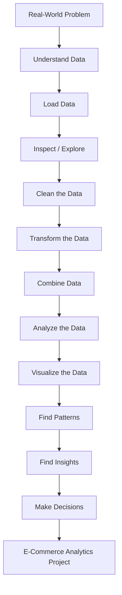
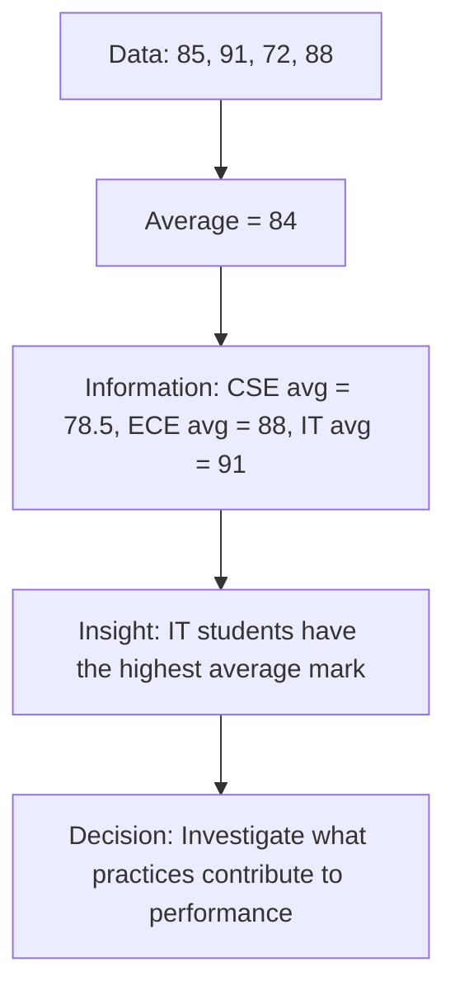
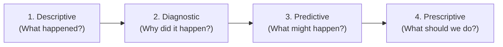
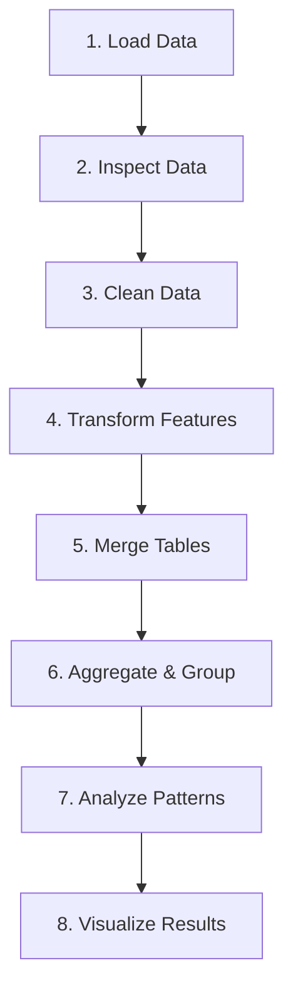

# Data Analytics — Beginner to Project Roadmap

## Overall Journey



---

## Build the Data Analytics Mindset

### What is Data?

#### Goal
Students should first understand what "data" actually means.

Start with something extremely simple:

| Student | Age | Department | Mark |
| :--- | :--- | :--- | :--- |
| Arun | 20 | CSE | 85 |
| Priya | 21 | IT | 91 |
| Ravi | 20 | CSE | 72 |
| Meena | 22 | ECE | 88 |

> "What can we learn from this?"

- Highest mark
- Average mark
- Number of students
- Which department performs better

- **Data** is raw material.
- **Analytics** is the process of turning that raw material into useful understanding.

#### Example Walkthrough



> *"Find 5 questions that this dataset can answer."*

---

### What is Data Analytics?

> **Data Analytics** = Examining data to find useful patterns, relationships, and insights that support decisions.

#### Example: E-Commerce Company
An E-Commerce company says:
> *"Our sales are falling. Find out why."*

**Students need to think through the investigation:**
```text
Sales falling
     ↓
Which products?
     ↓
Which customers?
     ↓
Which locations?
     ↓
Which months?
     ↓
Which customer segments?
     ↓
Why?
     ↓
What should we do?
```

> **Key Takeaway:** Analytics begins with a question, not with Python.

---

### Data Science vs Data Analytics

```text
Data Science
    │
    ├── Data Collection
    ├── Data Engineering
    ├── Data Analytics
    ├── Machine Learning
    └── AI
```

#### Example Scenario: Online Shopping Platform
- **Data Analytics:** Which products sold the most last month?
- **Data Science / ML:** Which customers are likely to purchase next month?
- **Data Engineering:** How do we collect and store millions of transactions?

> **Key Takeaway:** Analytics is one essential part of the larger data ecosystem.

---

## Understand the Data

### Types of Data

Introducing a simple E-Commerce dataset:

| Customer | Age | City | Product | Price | Quantity | Order Date |
| :--- | :--- | :--- | :--- | :--- | :--- | :--- |
| C01 | 21 | Chennai | Laptop | 60000 | 1 | 2026-01-05 |
| C02 | 25 | Coimbatore | Mouse | 1200 | 2 | 2026-01-06 |
| C03 | 31 | Chennai | Keyboard | 2500 | 1 | 2026-01-07 |

- **Numerical:** `Age`, `Price`, `Quantity`
- **Categorical:** `City`, `Product`
- **Date/Time:** `Order Date`
- **Identifier:** `Customer` / `Customer ID`

*(This classification becomes foundational when performing analysis and feature engineering.)*

---

### Structured vs Semi-Structured vs Unstructured Data

Show real-world examples of each format:

#### 1. Structured Data (Tabular)
| Customer | Age | City | Purchase |
| :--- | :--- | :--- | :--- |
| C001 | 21 | Chennai | 5000 |

#### 2. Semi-Structured Data (JSON / Key-Value)
```json
{
  "customer": "C001",
  "age": 21,
  "city": "Chennai"
}
```

#### 3. Unstructured Data (Free Text / Media)
> "I purchased a laptop yesterday. The delivery was excellent."

> **Note:** Analytics can involve all three types, but foundational analytics primarily utilizes **structured data**.

---

## Start Python for Analytics

### Python Basics Required for Analytics

#### Variables & Arithmetic
```python
price = 50000
quantity = 2

total = price * quantity
print(total)
# Output: 100000
```

#### Lists
```python
prices = [1000, 2000, 3000, 4000]
```

#### Conditions
```python
purchase = 5000

if purchase > 3000:
    print("High value customer")
```

#### Loops
```python
prices = [1000, 2000, 3000]

for price in prices:
    print(price)
```

---

### Introduce Pandas

Introducing Pandas as the standard tabular data library:

```python
import pandas as pd

# Create a DataFrame
data = {
    "customer": ["A", "B", "C"],
    "age": [21, 25, 30],
    "purchase": [1000, 2500, 5000]
}

df = pd.DataFrame(data)
print(df)
```

**Output:**
```text
  customer  age  purchase
0        A   21      1000
1        B   25      2500
2        C   30      5000
```

---

### Load Real Data

Transition from hardcoded data to loading CSV files:

```python
df = pd.read_csv("ecommerce.csv")
df.head()
```
> *"I just received this dataset. I know nothing about it. What should I do first?"*

This naturally leads into **Exploratory Data Analysis (EDA)**.

---

## Learn to Inspect Data

### Understanding a Dataset

Teach foundational inspection methods:

| Method / Property | Description | Purpose / Question Answered |
| :--- | :--- | :--- |
| `df.head()` | First 5 rows | What does my data look like? |
| `df.tail()` | Last 5 rows | Are there summary/corrupted rows at the end? |
| `df.shape` | `(rows, columns)` (e.g., `(10000, 12)`) | How large is the dataset? |
| `df.columns` | Column names list | What attributes do we have? |
| `df.info()` | Data types and non-null counts | Are types correct? Any missing values? |
| `df.describe()` | Statistical summary (mean, std, min, max, quantiles) | What are the distributions of numerical columns? |

---

### Ask Questions About Data

Given the following sample:

| Age | Purchase |
| :--- | :--- |
| 20 | 1000 |
| 22 | 1500 |
| 25 | 3000 |
| 31 | 5000 |
| 45 | 7000 |

> "What business questions can we formulate?"

**Examples:**
- What is the average purchase amount?
- Who spends the most?
- What is the minimum vs maximum purchase?
- Does purchase amount increase with age?

> **Golden Rule:** An analyst asks questions before writing code.

---

## Data Cleaning

### Missing Data

Present an intentionally messy dataset:

| Customer | Age | City | Purchase |
| :--- | :--- | :--- | :--- |
| A | 21 | Chennai | 1000 |
| B | `NaN` | Chennai | 2000 |
| C | 25 | `NaN` | 1500 |
| D | 30 | Coimbatore | `NaN` |

#### Detection & Handling
```python
# Detect missing values
df.isnull()
df.isnull().sum()

# Drop rows with nulls
df.dropna()

# Fill missing values
df.fillna(...)
```

> **Important:** There is no single universal way to handle missing data—the appropriate strategy depends entirely on the business context and problem.

---

### Duplicate Data

Given duplicate rows:

| Customer | City | Purchase |
| :--- | :--- | :--- |
| A | Chennai | 1000 |
| B | Coimbatore | 2000 |
| A | Chennai | 1000 |

#### Detection & Removal
```python
# Identify duplicates
df.duplicated()

# Remove duplicates
df.drop_duplicates()
```

**Challenge Question:**
> *"Should every duplicate row always be deleted?"* (Encourages thinking about transactions vs user profiles).

---

### Incorrect & Inconsistent Data

#### Outliers / Errors
| Age |
| :--- |
| 21 |
| 25 |
| 30 |
| **250** |
| 19 |

- Python accepts `250` as a valid integer, but domain knowledge tells us it is invalid.
- **Key Insight:** Data quality validation requires domain knowledge.

#### Text Inconsistency
```text
Chennai
chennai
CHENNAI
Chennai 
```
Requires standardization using `.str.strip()` and `.str.capitalize()` / `.str.upper()`.

---

## Data Transformation

### Creating New Columns (Feature Engineering)

Given:
| Price | Quantity |
| :--- | :--- |
| 1000 | 2 |
| 2000 | 3 |
| 5000 | 1 |

```python
df["revenue"] = df["price"] * df["quantity"]
```

**Result:**
| Price | Quantity | Revenue |
| :--- | :--- | :--- |
| 1000 | 2 | 2000 |
| 2000 | 3 | 6000 |
| 5000 | 1 | 5000 |

---

### Filtering Data

#### Single Condition
```python
# Customers who spent more than ₹5,000
df[df["purchase"] > 5000]

# Customers from Chennai
df[df["city"] == "Chennai"]
```

#### Multiple Conditions
```python
df[
    (df["city"] == "Chennai") & 
    (df["purchase"] > 5000)
]
```

---

### Sorting

```python
# Highest-spending customers first
df.sort_values("purchase", ascending=False)
```

---

### Grouping & Aggregations

Given:
| City | Revenue |
| :--- | :--- |
| Chennai | 5000 |
| Chennai | 3000 |
| Coimbatore | 7000 |
| Coimbatore | 2000 |

```python
# Revenue by city
df.groupby("city")["revenue"].sum()
```

**Result:**
```text
city
Chennai       8000
Coimbatore    9000
Name: revenue, dtype: int64
```

Common aggregation functions:
- `.sum()`
- `.mean()`
- `.count()`
- `.min()`
- `.max()`

---

## Combining Data

### Why Do We Need Multiple Tables?

#### Customers Table
| customer_id | name | city |
| :--- | :--- | :--- |
| C01 | Arun | Chennai |
| C02 | Priya | Coimbatore |

#### Orders Table
| order_id | customer_id | amount |
| :--- | :--- | :--- |
| O01 | C01 | 5000 |
| O02 | C02 | 3000 |

**Common Key:** `customer_id`

---

### Merging Datasets

```python
result = orders.merge(customers, on="customer_id")
```

**Result:**
| order_id | customer_id | amount | name | city |
| :--- | :--- | :--- | :--- | :--- |
| O01 | C01 | 5000 | Arun | Chennai |
| O02 | C02 | 3000 | Priya | Coimbatore |

#### Join Types Concept
- **INNER JOIN:** Keep records matching in both tables.
- **LEFT JOIN:** Keep all records from the left table.
- **RIGHT JOIN:** Keep all records from the right table.
- **OUTER JOIN:** Keep all records from both tables.

---

## Reshaping and Pivoting

### Pivot Tables

Given:
| Customer | Category | Revenue |
| :--- | :--- | :--- |
| A | Electronics | 5000 |
| A | Grocery | 2000 |
| B | Electronics | 8000 |
| B | Grocery | 1000 |

```python
pd.pivot_table(
    df,
    values="revenue",
    index="customer",
    columns="category",
    aggfunc="sum"
)
```

**Result:**
| customer | Electronics | Grocery |
| :--- | :--- | :--- |
| A | 5000 | 2000 |
| B | 8000 | 1000 |

---

## Exploratory Data Analysis (EDA)

> **EDA** is the process of investigating a dataset to understand its structure, distributions, relationships, patterns, anomalies, and interesting observations.

### Univariate Analysis (One Variable)
- **Example:** `Customer Age`
- **Questions:** Average age? Minimum/Maximum age? Common age range? Outliers?
```python
df["age"].describe()
df["age"].plot.hist()
```

---

### Bivariate Analysis (Two Variables)
- **Example:** `Age` vs `Purchase Amount`
- **Question:** *"Do older customers spend more?"*
```python
df.plot.scatter(x="age", y="purchase_amount")
```

---

### Multivariate Analysis (Three or More Variables)
- **Example:** `Age` + `City` + `Category` + `Purchase Amount`
- **Question:** *"Which age group in which city spends the most on electronics?"*
- Combines filtering, grouping, and multidimensional aggregation.

---

## Statistics for Analytics

### Descriptive Statistics: Mean vs. Median

| Data Sample | Mean | Median |
| :--- | :--- | :--- |
| `10, 20, 30` | 20 | 20 |
| `10, 20, 100` | 43.33 | 20 |

#### Demonstrating Outlier Impact on Customer Spending
Given customer purchases:
- ₹1,000
- ₹1,200
- ₹1,500
- ₹2,000
- **₹1,00,000** *(Outlier)*

> *"Does the mean of ₹21,140 represent a typical customer?"*  
> (Illustrates why the median is robust to outliers).

---

### Distributions

Key distribution concepts to teach:
- **Normal Distribution**
- **Skewed Distribution** (Right/Left skewed)
- **Outliers & Spread** (Variance & Standard Deviation)

> **Insight:** "Average alone doesn't tell the whole story."

---

## Visualization

### Choosing the Right Chart

| Business Question | Best Chart Type |
| :--- | :--- |
| Which category sells the most? | **Bar Chart** |
| How are sales changing over time? | **Line Chart** |
| How is customer age distributed? | **Histogram** |
| Are age and spending related? | **Scatter Plot** |
| How does a variable spread and where are outliers? | **Box Plot** |

---

### Bar Chart
```python
# Highest revenue by category
df.groupby("category")["revenue"].sum().plot.bar()
```

---

### Line Chart
```python
# Monthly sales trends
df["month"] = df["order_date"].dt.month
df.groupby("month")["revenue"].sum().plot.line()
```
Identify: **Trends**, **Growth**, **Decline**, and **Seasonality**.

---

### Histogram
```python
# Typical customer purchase distribution
df["purchase_amount"].plot.hist()
```
Identify: **Distribution shape**, **Concentration**, **Skewness**, and **Outliers**.

---

### Scatter Plot
```python
# Session duration vs purchase amount
df.plot.scatter(x="session_duration", y="purchase_amount")
```

> **Critical Principle:** Correlation does not imply causation.

---

## Types of Analytics



### Descriptive Analytics
- **Question:** What happened?
- **Example:** *"Revenue in August was ₹25 Lakhs."*

### Diagnostic Analytics
- **Question:** Why did it happen?
- **Example:** *"Revenue decreased because electronics sales declined by 18%."*

### Predictive Analytics
- **Question:** What might happen?
- **Example:** *"Based on seasonal patterns, next month's demand will likely increase by 15%."*

### Prescriptive Analytics
- **Question:** What should we do?
- **Example:** *"Increase inventory for top-selling products by 20% before the festival season."*

---

## Popular Data Analytics Methods

### Customer Segmentation

Group customers based on spending brackets:
- **Low Value:** ₹0 – ₹5,000
- **Medium Value:** ₹5,001 – ₹20,000
- **High Value:** ₹20,001+

> *"Which customer segment contributes the highest percentage of overall revenue?"*

---

### Correlation Analysis

```python
# Calculate correlation between session duration and purchase amount
df["session_duration"].corr(df["purchase_amount"])
```

> **Reminder:** $\text{Correlation} \neq \text{Causation}$.

---

## Classical vs. Bayesian Analysis

### Classical (Frequentist) Thinking
- **Scenario:** *"Does a new website design increase purchases?"*
- **Comparison:** Old design (100 purchases) vs. New design (130 purchases).
- **Question:** Is the 30-purchase difference statistically significant or merely random variation?

### Bayesian Thinking
```text
Prior Belief  +  New Evidence  ──>  Updated Belief (Posterior)
```

---

## Main Project: E-Commerce Customer Behaviour Analysis

### Dataset Schema
Students work with a realistic e-commerce transactions dataset containing:
- `customer_id`
- `age`
- `gender`
- `city`
- `device`
- `session_duration`
- `pages_viewed`
- `product_id`
- `product_category`
- `product_price`
- `quantity`
- `discount`
- `purchase_amount`
- `payment_method`
- `order_date`
- `returned`

---

### Project Question Bank

| Dimension | Key Questions |
| :--- | :--- |
| **Customer** | Who are our primary customers by demographics? |
| **Product** | What product categories have the highest and lowest sales? |
| **Revenue** | Which categories and cities generate the most revenue? |
| **Behaviour** | Which customer segments spend the most? |
| **Time** | When do peak purchases occur (day of week, time of month)? |
| **Device** | Do mobile users exhibit different buying behavior compared to desktop users? |
| **Engagement**| Does higher session duration correlate with higher purchase amounts? |
| **Returns** | Which product categories have the highest return rates? |

---

### Build the Analytical Pipeline



---

### Create Customer Profiles

Calculate summary metrics for each customer:
- Total Orders
- Total Spending
- Average Order Value (AOV)
- Last Purchase Date
- Favourite Category
- Number of Returns

**Example Aggregated Profile:**
| Customer | Orders | Spending | Avg Order Value | Favourite Category |
| :--- | :--- | :--- | :--- | :--- |
| C001 | 15 | ₹45,000 | ₹3,000 | Electronics |
| C002 | 3 | ₹4,500 | ₹1,500 | Grocery |

---

### Customer Segmentation Hierarchy

```text
                     Customers
                         │
         ┌───────────────┼───────────────┐
         ↓               ↓               ↓
     Low Value      Medium Value     High Value
```

> *"Which specific customer segment should receive personalized premium promotions?"*

---

## Final Analytics Story (Presentation Framework)

Each student/team structures their findings into a 7-part narrative:

1. **Problem Statement:**  
   *"The company wants to understand customer behavior and identify drivers of revenue."*
2. **Data Overview:**  
   *"Analyzed 50,000 e-commerce transaction records spanning 12 months."*
3. **Data Cleaning:**  
   *"Handled missing values in customer profiles, dropped duplicate records, and standardized city names."*
4. **Key Analysis:**  
   *"Electronics generated the highest total revenue, while Groceries had the highest repeat purchase frequency."*
5. **Visualizations:**  
   *Clear bar charts, line trends, and distribution histograms supporting the analysis.*
6. **Core Insights:**  
   *"Customers aged 20–30 contributed 48% of electronics purchases but exhibited the highest return rates."*
7. **Actionable Recommendations:**  
   *"Deploy targeted retention campaigns for high-value segments and improve electronics product descriptions to reduce returns."*