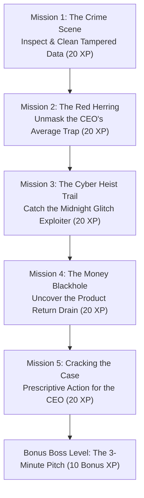

The Data Detective Challenge — The Mystery of QuickMart's Leaking Profits


Today, you step out of the classroom and into the shoes of the **Lead Data Analyst & Retail Detective** at **QuickMart**, an online shopping platform.

---

## The Emergency Briefing

It is Monday morning. QuickMart’s CEO calls an urgent emergency meeting with you:

> *"Look at our dashboard! Our sales volume is up, and our revenue numbers look impressive on paper. But when I checked our company bank account this morning, we are bleeding cash every single week!*
>
> *I don't know if our website has a bug, if someone is exploiting our system, or if our operations are failing. Here is our raw transaction file (`mystery_ecommerce.csv`).*
>
> *I need you to interrogate this data, find out where our money is vanishing, and tell me what to do before the board meeting this afternoon!"*

---

## Game Rules & Detective Scorecard

- **Total Possible Score:** **100 XP** (+ 10 Bonus XP)
- **Toolbox:** Google Colab / Jupyter Notebook using Python & Pandas.
- **Dataset File:** [`mystery_ecommerce.csv`](file:///Users/harinikesh/Downloads/data_analytics_notebook/day2/mystery_ecommerce.csv) (in this folder).

### Detective Ranks:
| Total XP Earned | Detective Rank |
| :--- | :--- |
| **90 – 110 XP** | 🕵️‍♂️ **Master Chief Analyst** (Promoted to Head of BI) |
| **75 – 89 XP** | 🔎 **Senior Data Detective** (Commended by the CEO) |
| **60 – 74 XP** | 📁 **Junior Investigator** (Good progress, case solved) |
| **Below 60 XP**| 📋 **Data Trainee** (Needs another round of training) |

---

## Investigation Roadmap



---

## Mission 1: The Crime Scene (Data Inspection & Hygiene)
**Reward: 20 XP**

### Detective Challenge:
Before analyzing any data, a good detective verifies the integrity of the crime scene. The CEO suspects someone might have tampered with the logs or corrupted the files.

**Your Tasks:**
1. Load `mystery_ecommerce.csv` and find the exact number of rows and columns.
2. Check if duplicate transaction logs were inserted into the system. If so, drop them.
3. Check for missing values (`NaN`) and identify if there are any physiologically impossible values (like an impossible human age).

---

#### Detective Clue & Concept Notes:
- Use `pd.read_csv("mystery_ecommerce.csv")` to load the dataset.
- `df.shape` gives you `(rows, columns)`.
- `df.duplicated().sum()` detects identical repeated transactions.
- `df.drop_duplicates()` cleans them.
- `df.isnull().sum()` finds missing values.

#### Colab Investigation Code:
```python
# [Mission 1] Inspect and sanitize the crime scene
import pandas as pd
import numpy as np

# 1. Load dataset
df = pd.read_csv("mystery_ecommerce.csv")
print(f"Initial Crime Scene Dimensions: {df.shape[0]} rows, {df.shape[1]} columns")

# 2. Find and remove duplicate records
dup_count = df.duplicated().sum()
print(f" Suspicious Duplicate Entries Found: {dup_count}")
df = df.drop_duplicates()
print(f"✓ Crime scene secured. Verified rows remaining: {len(df)}")

# 3. Check for missing values
print("\n--- Missing Value Inspection ---")
print(df.isnull().sum()[df.isnull().sum() > 0])

# 4. Spot impossible age entries
print("\nAge extremes:")
print(f"Minimum Age: {df['age'].min()}, Maximum Age: {df['age'].max()}")
```

#### Expected Output:
```text
Initial Crime Scene Dimensions: 175 rows, 15 columns
Suspicious Duplicate Entries Found: 4
✓ Crime scene secured. Verified rows remaining: 171

--- Missing Value Inspection ---
city               1
age                1
purchase_amount    1

Age extremes:
Minimum Age: 20.0, Maximum Age: 300.0
```

#### Detective Clue Unlocked:
> **Clue #1:** The raw data had **4 duplicate orders** inflating revenue numbers, and a corrupted entry with an age of **300 years**! 
> Always sanitize the data first so you don't build business decisions on corrupted rows.

---

## Mission 2: The Red Herring (The CEO's Blindspot)
**Reward: 20 XP**

### Detective Challenge:
The CEO interrupts you: 
> *"Look, our average purchase amount is over ₹7,000 per order! That's higher than our competitors. Surely our pricing isn't the problem!"*

Your analytical instinct tells you that the CEO might be falling for **The Average Trap** (where a single massive outlier distorts the truth).

**Your Tasks:**
1. Calculate both the **Mean (Average)** and the **Median (Middle Value)** of `purchase_amount`.
2. Find the single largest transaction in the entire dataset.
3. Explain to the CEO why their "high average" is an illusion.

---

#### Detective Clue & Concept Notes:
- `df["purchase_amount"].mean()` calculates the arithmetic average (heavily pulled by extreme high values).
- `df["purchase_amount"].median()` sorts values and takes the true middle (robust against outliers).
- `df.sort_values(by="purchase_amount", ascending=False).head(1)` shows the biggest transaction.

#### Colab Investigation Code:
```python
# [Mission 2] Unmasking the Mean vs. Median Trap
mean_val = df["purchase_amount"].mean()
median_val = df["purchase_amount"].median()

print(f"CEO's Claimed Mean Spend   : ₹{mean_val:,.2f}")
print(f"Reality (Median Spend)     : ₹{median_val:,.2f}")

# Spot the massive outlier
top_order = df.sort_values(by="purchase_amount", ascending=False).iloc[0]
print("\nTHE MONSTER TRANSACTION:")
print(f"Order ID       : {top_order['order_id']}")
print(f"Customer       : {top_order['customer_id']}")
print(f"Product        : {top_order['product_name']} ({top_order['quantity']} units)")
print(f"Purchase Amount: ₹{top_order['purchase_amount']:,.2f}")
```

#### Expected Output:
```text
CEO's Claimed Mean Spend   : ₹7,094.88
Reality (Median Spend)     : ₹2,200.00

THE MONSTER TRANSACTION:
Order ID       : ORD0156
Customer       : C050
Product        : Laptop (5 units)
Purchase Amount: ₹250,000.00
```

#### Detective Clue Unlocked:
> **Clue #2:** The CEO was deceived! A single corporate purchase of **₹2,50,000** pulled the average up to ₹7,094. 
> In reality, **50% of your regular customers spend ₹2,200 or less**. The business is not as rich per customer as management assumed!

---

## Mission 3: The Cyber Heist Trail (Filtering & Slicing)
**Reward: 20 XP**

### Detective Challenge:
While digging through social media, customer service forwarded an anonymous tip: 
> *"A user on a private forum claimed they found a glitch in QuickMart's checkout system to buy brand-new laptops for pennies in the dead of night."*

**Your Tasks:**
1. Write a query to filter for any orders where the discount percentage was **50% or higher** (`discount_pct >= 0.50`).
2. Inspect the resulting orders:
   - What account placed them?
   - What city was delivery set to?
   - What was the checkout session duration?
   - What time did these orders occur?

---

#### Detective Clue & Concept Notes:
- Filter using Boolean masking: `df[df["discount_pct"] >= 0.50]`.
- Check attributes: `customer_id`, `product_name`, `discount_pct`, `order_time`, `session_duration_mins`.

#### Colab Investigation Code:
```python
# [Mission 3] Tracking the Midnight Glitch Exploit
suspicious_orders = df[df["discount_pct"] >= 0.50]

print(f"Total Glitch Orders Detected: {len(suspicious_orders)}\n")
print(suspicious_orders[[
    "order_id", "customer_id", "city", "product_name", 
    "quantity", "discount_pct", "purchase_amount", 
    "session_duration_mins", "order_time"
]])
```

#### Expected Output:
```text
Total Glitch Orders Detected: 5

    order_id customer_id     city product_name  quantity  discount_pct  purchase_amount  session_duration_mins          order_time
150  ORD0151        C999  Madurai       Laptop         2           0.9          11000.0                      1    2026-02-14 02:15
151  ORD0152        C999  Madurai       Laptop         2           0.9          11000.0                      1    2026-02-14 02:40
152  ORD0153        C999  Madurai       Laptop         2           0.9          11000.0                      1    2026-02-28 03:10
153  ORD0154        C999  Madurai       Laptop         2           0.9          11000.0                      1    2026-03-05 02:50
154  ORD0155        C999  Madurai       Laptop         2           0.9          11000.0                      1    2026-03-12 03:25
```

#### Detective Clue Unlocked:
> **Clue #3: THE CYBER HEIST CONFIRMED!**  
> Phantom customer **`C999`** in **Madurai** exploited a coupon vulnerability between **2:00 AM and 3:30 AM** with scripted 1-minute sessions.  
> They purchased **10 premium laptops** (retail value: ₹5,50,000) for only **₹55,000**, pocketing a **90% discount**! That’s an immediate direct cash loss of **₹4,95,000**!

---

## Mission 4: The Silent Drain (Grouping & Aggregations)
**Reward: 20 XP**

### Detective Challenge:
You caught the laptop thief! But the CFO comes running in:
> *"Even before that laptop incident, our logistics and reverse-courier fees were eating 30% of our operating margin! Are products being returned at an alarming rate?"*

**Your Tasks:**
1. Group the data by `product_category` and calculate the **Return Rate** (`returned == 'Yes'`) for each category.
2. For the category with the highest return rate, find out which **specific product** and **city** is driving the returns.

---

#### Detective Clue & Concept Notes:
- `df.groupby("product_category")` bundles rows by department.
- Compute return rate with `.agg(Return_Rate=("returned", lambda x: (x == "Yes").mean() * 100))`.
- Filter down into the offending category to inspect products and locations.

#### Colab Investigation Code:
```python
# [Mission 4] Uncovering the Product Return Drain
cat_returns = df.groupby("product_category").agg(
    Total_Orders=("order_id", "count"),
    Returned_Orders=("returned", lambda x: (x == "Yes").sum()),
    Return_Rate_Pct=("returned", lambda x: (x == "Yes").mean() * 100)
).sort_values(by="Return_Rate_Pct", ascending=False)

print("--- RETURN RATE ACROSS CATEGORIES ---")
print(cat_returns.round(2))

# Drill-down into Fashion
fashion_orders = df[df["product_category"] == "Fashion"]
fashion_drilldown = fashion_orders.groupby(["product_name", "city"]).agg(
    Orders=("order_id", "count"),
    Returns=("returned", lambda x: (x == "Yes").sum()),
    Return_Pct=("returned", lambda x: (x == "Yes").mean() * 100)
).sort_values(by="Returns", ascending=False)

print("\n--- FASHION DRILLDOWN (PRODUCT × CITY) ---")
print(fashion_drilldown.head(6))
```

#### Expected Output:
```text
--- RETURN RATE ACROSS CATEGORIES ---
                  Total_Orders  Returned_Orders  Return_Rate_Pct
product_category                                                
Fashion                     57               23            40.35
Electronics                 49                4             8.16
Home & Living               36                1             2.78
Grocery                     29                1             3.45

--- FASHION DRILLDOWN (PRODUCT × CITY) ---
                                   Orders  Returns  Return_Pct
product_name   city                                           
Leather Jacket Coimbatore              10        9       90.00
               Kochi                    8        7       87.50
Running Shoes  Madurai                  4        2       50.00
Denim Jeans    Chennai                  6        2       33.33
```

#### Detective Clue Unlocked:
> **Clue #4: THE INVENTORY BLEED!**  
> While Electronics and Grocery have healthy return rates (< 8%), **Fashion has a catastrophic 40.35% return rate**.  
> In particular, **Leather Jackets** sold in **Coimbatore & Kochi** have an astronomical **~90% return rate**! Every return costs ₹350 in reverse logistics and packaging damage.

---

## Mission 5: Cracking the Case & Executive Prescription
**Reward: 20 XP**

### Detective Challenge:
You have connected all the dots. Now you must transition from an **Investigative Analyst** to an **Executive Advisor**.

**Your Tasks:**
1. Quantify the exact financial impact of:
   - **Glitch Leak:** Lost revenue from `C999`'s 90% coupon hack.
   - **Return Logistics Leak:** Estimated reverse-shipping cost for returned Fashion items (assume ₹350 cost per return).
2. Formulate **2 concrete, actionable business recommendations** for the CEO.

---

#### Colab Calculation Code:
```python
# [Mission 5] Financial Loss Calculation
glitch_loss = (55000 * 2 * 5) - (suspicious_orders["purchase_amount"].sum())
total_fashion_returns = cat_returns.loc["Fashion", "Returned_Orders"]
logistics_waste = total_fashion_returns * 350

print("=" * 65)
print(" FINANCIAL DAMAGE AUDIT REPORT")
print("=" * 65)
print(f"1. Midnight Promo Exploit Leak : ₹{glitch_loss:,.2f}")
print(f"2. Fashion Reverse Courier Cost: ₹{logistics_waste:,.2f} ({total_fashion_returns} returned parcels)")
print(f"TOTAL PREVENTABLE BLEED        : ₹{glitch_loss + logistics_waste:,.2f}")
print("=" * 65)
```

#### Expected Output:
```text
=================================================================
 FINANCIAL DAMAGE AUDIT REPORT
=================================================================
1. Midnight Promo Exploit Leak : ₹495,000.00
2. Fashion Reverse Courier Cost: ₹8,050.00 (23 returned parcels)
TOTAL PREVENTABLE BLEED        : ₹503,050.00
=================================================================
```

---

## Bonus Boss Level: The 3-Minute CEO Pitch
**Reward: 10 Bonus XP**

Stand before your class (or type out your final pitch) as if addressing the Board of Directors:

```text
"Mr. CEO, here is why our cash was disappearing:

1. THE SYSTEM VULNERABILITY (₹4.95 Lakhs Lost):
   A single user (C999) exploited a recurring 90% discount vulnerability on Laptops in Madurai 
   between 2:00 AM and 3:30 AM. 
   ACTION: Patch the checkout coupon engine to cap maximum electronics discounts at 15% and 
   cancel unfulfilled COD orders to customer C999.

2. THE SUPPLIER DEFECT (40% Fashion Return Rate):
   Leather jackets shipped to Coimbatore and Kochi have an 89% return rate due to 
   severe size mismatch from our regional vendor.
   ACTION: Immediately pause online listings for the current Leather Jacket batch, audit 
   the vendor's sizing chart, and introduce a 3D size-recommender in the mobile app.

3. THE METRIC ILLUSION:
   Our apparent '₹7,094 average spend' was distorted by one ₹2.5 Lakh corporate transaction. 
   Our true typical customer spends ₹2,200. We must target our promotions around the 
   ₹2,000 - ₹3,000 sweet spot."
```

---

## Summary of Skills 

| Mystery Mission | Data Analyst Skill Mastered |
| :--- | :--- |
| **Mission 1** | Cleaned duplicates, handled null values, and recognized domain outliers. |
| **Mission 2** | Understood why the **Median** is safer than the **Mean** when outliers are present. |
| **Mission 3** | Used **Compound Boolean Filtering** to track fraud and rogue behavior. |
| **Mission 4** | Used **Multi-Level GroupBy** to identify specific product/location operational issues. |
| **Mission 5** | Converted code outputs into **Financial Impact** and **Prescriptive Business Actions**. |
